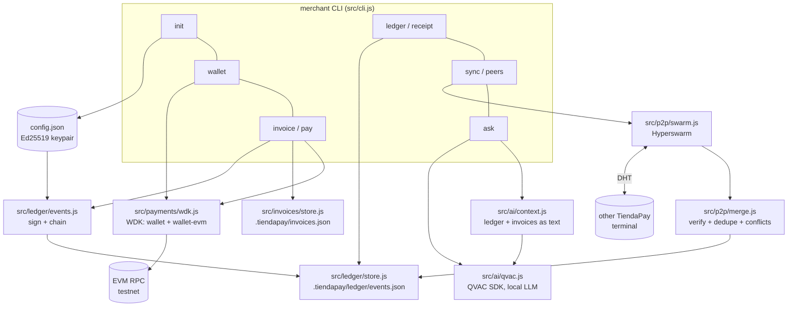

# TiendaPay — Architecture

This document describes how TiendaPay is built: the runtime it targets, the module
layout, the data model, and the design decisions behind each subsystem. It assumes
the reader is technical (engineer, judge, contributor). For a non-technical overview
see [`README.md`](README.md); for the pitch see [`deck.md`](deck.md).

## 1. What TiendaPay is

TiendaPay is a self-custodial USD₮ payment terminal for small and medium
businesses, shipped as a single command-line application (`merchant <command>`).
It has four cooperating subsystems:

1. **Payments** — a non-custodial EVM wallet (Tether's WDK) that sends and
   receives USD₮ and quotes network fees before every transfer.
2. **Ledger** — an append-only, cryptographically signed local record of every
   payment, independent of any blockchain confirmation.
3. **Sync** — peer-to-peer replication of that ledger between terminals over
   Hyperswarm, with conflict detection instead of silent overwrite.
4. **Assistant** — an optional, fully local LLM (QVAC) that answers natural-language
   questions about the merchant's own sales data, with zero network calls at
   query time.

None of these subsystems depend on a company-run server. The CLI runs on
[Bare](https://bare.pears.com), the same lightweight JavaScript runtime used by
[Pear](https://pears.com) apps, so the exact same code can run as a local dev
tool (`bare index.js ...`) or be staged and distributed as a P2P application
(`pear stage`/`pear seed`, fetched by peers with `pear dump`). A separate,
self-contained submission in [`pear-cli/`](pear-cli/) goes one step further —
a standalone compiled binary installable with `pear install` and updated
peer-to-peer without any of `bare`/`pear`/Node installed on the receiving
machine — see §11.

## 2. System diagram



## 3. Runtime and stack

| Layer | Choice | Why |
|---|---|---|
| Runtime | [Bare](https://bare.pears.com) (Node-compatible subset) | Required to ship the CLI as a Pear P2P app; also runs directly for local development (`bare index.js`) |
| Distribution | [Pear](https://pears.com) | Peer-to-peer app distribution and OTA updates, no app store, no central server |
| Wallet / payments | [`@tetherto/wdk`](https://www.npmjs.com/package/@tetherto/wdk) + [`@tetherto/wdk-wallet-evm`](https://www.npmjs.com/package/@tetherto/wdk-wallet-evm) | Official Tether Wallet Development Kit; non-custodial EVM account derivation, balance, quote, transfer |
| P2P transport | [`hyperswarm`](https://www.npmjs.com/package/hyperswarm) | DHT-based peer discovery and encrypted connections, same stack Pear itself is built on |
| Signing / hashing | [`hypercore-crypto`](https://www.npmjs.com/package/hypercore-crypto) | Ed25519 keypairs, sign/verify, and a deterministic hash function reused for both the merchant identity and the ledger hash chain |
| Local AI | [`@qvac/sdk`](https://www.npmjs.com/package/@qvac/sdk) | Fully local LLM inference (llama.cpp-based), no data leaves the device |
| Storage | Flat JSON files under `.tiendapay/` | No database dependency; every file is human-inspectable and git-ignorable |

## 4. Module layout

```
index.js                   Entry point: resolves argv (Bare or Pear), dispatches, forces exit
src/
  cli.js                   Command router (name -> handler)
  commands/                One file per CLI command, thin — argument parsing + I/O only
    init.js  wallet.js  invoice.js  pay.js  ledger.js  receipt.js  sync.js  peers.js  ask.js  help.js  version.js
  payments/
    wdk.js                 WDK setup (seed phrase, RPC), address/balance/quote/transfer
  invoices/
    store.js                CRUD over .tiendapay/invoices.json
  ledger/
    canonical.js            Deterministic JSON serialization (sorted keys) for signing
    events.js                Create + verify signed ledger events, per-merchant hash chain
    store.js                  Append-only read/write over .tiendapay/ledger/events.json
  p2p/
    protocol.js              Newline-delimited JSON framing over a raw socket
    merge.js                  Verify, dedupe, and flag conflicts in events received from peers
    swarm.js                   Hyperswarm wiring: join a room, exchange ledgers, network timeouts
  ai/
    context.js               Turns invoices + ledger into a plain-text prompt context
    qvac.js                    QVAC plugin registration, model load, completion, timeout guard
  util/
    args.js  config.js  env.js  paths.js  units.js   Shared helpers (flag parsing, .env loading, BigInt <-> decimal formatting, filesystem paths)
```

Design rule followed throughout: **commands are thin, modules are the source of
truth.** A command file parses flags, calls one or two module functions, and
prints the result — no business logic lives in `src/commands/*`.

## 5. Data model

### 5.1 Invoice (`src/invoices/store.js`)

```json
{
  "id": "inv_...",
  "amount": "12500000",
  "currency": "USDT",
  "decimals": 6,
  "token": "0x...",
  "memo": "Compra #1042",
  "recipient": "0x...",
  "recipientIndex": 0,
  "status": "pending",
  "txHash": null,
  "fee": null,
  "payer": null,
  "receiptId": null,
  "createdAt": "...",
  "updatedAt": "..."
}
```

State machine: `pending -> submitted` (a real `txHash` came back from WDK) or
`pending -> failed` (the network call threw). There is no `confirmed` state yet —
`submitted` only means the transaction was broadcast (`eth_sendRawTransaction`
returned), not that it has been mined. See §8 for why.

### 5.2 Ledger event (`src/ledger/events.js`)

```json
{
  "id": "receipt_...",
  "type": "invoice_paid",
  "merchant": "<merchant's P2P Ed25519 public key, hex>",
  "invoiceId": "inv_...",
  "amount": "12500000",
  "currency": "USDT",
  "decimals": 6,
  "chain": "testnet",
  "payer": "0x...",
  "recipient": "0x...",
  "txHash": "0x...",
  "createdAt": "...",
  "previousEventId": "<this merchant's previous event id, or null>",
  "previousEventHash": "<hash of that previous event, or null>",
  "signature": "<Ed25519 signature over every field above, hex>"
}
```

Two properties matter:

- **The signature covers the whole record.** It is computed over a canonical
  (sorted-key) JSON serialization of every field except `signature` itself
  (`src/ledger/canonical.js`). Changing any field — amount, recipient, `txHash`,
  timestamps — invalidates the signature. This is what "receipt cannot be
  forged" means concretely.
- **The chain is per-merchant, not global to the file.** `previousEventId` /
  `previousEventHash` point at *that merchant's own* previous event, looked up
  by id — not "whatever the previous line in the file happens to be." This was
  a deliberate fix: an earlier version chained against `store.last()` (the
  last event in the whole file), which broke the moment a second merchant's
  events landed in the same local store via sync. Verification
  (`merchant receipt verify`) resolves the referenced event by id and checks
  both the signature and the hash link.

## 6. Command flow: paying an invoice

```
merchant pay <invoice-id> --yes
  -> src/commands/pay.js
       -> invoices/store.get(id)                       load the invoice
       -> payments/wdk.quoteTransfer(...)               fee estimate (shown even without --yes)
       -> payments/wdk.transfer(...)                     broadcast the ERC-20 transfer via WDK
       -> ledger/events.createEvent({ type: 'invoice_paid', ... })
            -> looks up this merchant's last event (chain link)
            -> signs the canonical payload with the P2P identity's secret key
            -> ledger/store.append(event)
       -> invoices/store.update(id, { status: 'submitted', txHash, receiptId })
```

If `wdk.transfer` throws (no RPC, insufficient funds, etc.), the invoice is
marked `failed` and **no ledger event is created** — a failed payment never
produces a signed receipt.

## 7. P2P sync design

`merchant sync --room <name>` and `merchant peers --room <name>` both use
Hyperswarm, joining a topic derived from `sha256("tiendapay:ledger:<room>")`
(via `hypercore-crypto`'s hash function — any two terminals using the same
room name converge on the same topic and can discover each other on the DHT).

**Deliberate simplification vs. the "textbook" Hypercore pattern.** The
canonical way to do multi-writer P2P sync in the Holepunch ecosystem is: each
peer keeps its own Hypercore (an append-only log with a public key), and peers
replicate each other's Hypercores via `corestore` once they've exchanged
public keys. TiendaPay does not do this. Instead, on every new connection each
side sends its **entire local ledger** as a single newline-delimited JSON
message (`src/p2p/protocol.js`), and the receiving side runs every incoming
event through `src/p2p/merge.js`:

1. Skip anything whose `id` is already stored (dedupe).
2. Skip anything whose `previousEventId` points at an event not yet held
   locally (wait for a later sync round instead of accepting an unverifiable
   link).
3. Verify the signature and the hash-chain link (`ledger/events.verifyEvent`).
4. Append only events that pass all of the above.
5. After merging, scan for **conflicts**: the same `invoiceId` with more than
   one distinct `txHash` across events from different merchants. These are
   reported, not auto-resolved — a human decides.

This was a conscious trade-off, not a shortcut taken for lack of time: the
security property that actually matters — nobody can forge or silently alter
a record — comes entirely from the Ed25519 signature (§5.2), which is
transport-independent. Gossiping signed events is simpler to reason about and
audit than a full multi-writer Hypercore/corestore setup, and it fully covers
the stated goal for this phase ("replicate events, not wallets"). A
feed-per-peer migration remains a reasonable next step if a reviewer expects
the canonical pattern specifically.

**Network robustness.** `swarm.join(topic).flushed()` and `swarm.destroy()`
can hang indefinitely if the DHT bootstrap nodes are unreachable — this is not
hypothetical, it was reproduced directly during development (see §9). Neither
call is awaited in a blocking way; every sync/peers invocation is bounded by
its `--timeout` flag plus a fixed cleanup window, regardless of network
reachability.

## 8. What "submitted" does and doesn't mean

`WalletAccountEvm.transfer()` (WDK) returns as soon as
`eth_sendRawTransaction` accepts the transaction — it does not wait for a
block confirmation. TiendaPay mirrors that honestly: an invoice becomes
`submitted` the instant WDK returns a hash, and the ledger event records that
same unconfirmed `txHash`. There is intentionally no `confirmed` state yet.
Adding one would mean polling `getTransactionReceipt` (or a similar call) and
plumbing a new status transition through both the invoice store and the
ledger — a reasonable next step, called out here rather than silently implied
by the current code.

## 9. What was verified against real infrastructure

An earlier draft of this document assumed the development sandbox had no
network egress, and qualified every network-dependent claim accordingly. That
turned out to be wrong for this environment specifically — it has real
outbound connectivity — so every one of those claims was re-verified live
instead of staying theoretical. Full transcripts and exact commands are in
[`TESTING.md`](TESTING.md); summary:

- **WDK payments** — a real testnet wallet was funded (Sepolia ETH for gas,
  and a mintable `ERC20Mock` USD₮ test token) and `wallet balance`, `invoice
  create`, and `pay --yes` were run against the live RPC end to end. The
  resulting `txHash` is real and is persisted in both the invoice and the
  signed ledger receipt.
- **P2P sync** — two independent merchant identities (two separate `.tiendapay`
  stores) ran `sync --room` concurrently on the same host and genuinely
  discovered each other over the DHT, exchanged ledger events, and correctly
  flagged a deliberately induced conflict (same `invoiceId`, two different
  `txHash` values) instead of silently overwriting either side. Discovery
  took ~60s, not the 20s default — this environment reports `firewalled:
  true` / `NAT type: consistent` on the DHT, which is worth budgeting for in
  production too, not just here.
- **QVAC** — the 773MB model completed its P2P download (~3 minutes) and
  produced an actual completion. The default 120s load timeout was too short
  for that download and had to be raised (`QVAC_LOAD_TIMEOUT_MS`); the answer
  quality itself was mediocre for a 1B-parameter quantized model, which is a
  product decision, not a plumbing bug.
- **Pear distribution** — `pear stage`/`pear seed`/`pear dump` all ran for
  real against the live network (not just against local corestore state).
  The CLI has changed shape since the version the original guidance assumed:
  `pear stage <channel>` no longer exists (it takes a `pear://` link from
  `pear touch` instead), and `pear run` has been removed entirely in favor of
  `pear dump` + running the binary directly, or `pear install` for a real
  standalone build (see §11).

None of this was "probably fine" — each bullet above has a corresponding
command transcript in `TESTING.md`, including the two real bugs that were
found and fixed in the process (a `swarm.join()`/`swarm.destroy()` hang with
unreachable DHT bootstrap nodes, and a `loadModel()` that would wait forever
without a timeout).

## 10. Security model summary

- **Self-custody.** The payment wallet is derived from `MERCHANT_SEED_PHRASE`
  (never transmitted anywhere); TiendaPay cannot move funds on the merchant's
  behalf outside of an explicit `pay --yes`.
- **Two independent keys, two independent purposes.** The P2P/ledger identity
  (Ed25519, from `merchant init`) and the payment wallet (EVM, from WDK) are
  deliberately separate — compromising one does not expose the other.
- **Tamper-evident history.** Every payment record is signed at creation time;
  altering a stored event after the fact is detectable by anyone with the
  merchant's public key (already embedded in the event) — see §5.2.
- **No custodial server.** There is no backend that holds funds, private
  keys, or the canonical copy of a merchant's sales history. `.tiendapay/`
  (keys) and `.env` (seed phrase) never leave the device and are excluded
  from version control.

## 11. `pear-cli/`: standalone installable binary (Pear Track submission)

TiendaPay-the-app runs on `bare` and is distributed as source (`pear
stage`/`pear seed`, fetched with `pear dump`) — that's what §9 above
validates. The Pear Track brief asks for something stricter: a tool
installable with a single `pear install pear://<key>`, with no `bare`/`pear`/
Node on the receiving machine, and with real peer-to-peer OTA updates landing
on an already-installed copy. That's a different artifact, so it lives in its
own subtree, [`pear-cli/`](pear-cli/), with its own `package.json` and build.

**Foundation.** Forked from Holepunch's official [`hello-pear-bare`
boilerplate](https://github.com/holepunchto/hello-pear-bare), `variant/daemon`
branch specifically — that variant runs the OTA updater as a detached
`bare-daemon` process and lets the foreground command exit immediately, which
is the right shape for a one-shot CLI (`invoice create`, `pay ...`) rather
than a long-lived TUI/service (that's what `main`/`variant/single-thread` are
for). `bin.mjs`/`app.js` (the updater wiring: `pear-runtime` +
`pear-runtime-updater` + `bare-daemon`) are kept as-is from the template;
`src/` is the same TiendaPay command set copied in verbatim, minus `ai/` and
the `ask` command (see below).

**Why `ask`/QVAC is excluded from this build specifically.** `@qvac/sdk`
pulls in native addon prebuilds for every platform (~6GB). That's an
acceptable cost for `npm install` on a dev machine, but it's the single
biggest risk to `bare-build` (the standalone-binary compiler) either failing
or producing an unreasonably large binary under a hackathon deadline. Every
other TiendaPay command is included.

**Build.** `bare-build` (via `bare-pack`, a static bundler) compiles
`bin.mjs` + everything it transitively `require`s into one self-contained
executable per platform — no separate `node_modules` needed at runtime. Two
things had to be worked around to get there, both from mismatches between how
`bare-pack` resolves modules and how the rest of this repo is set up:

- `bare-pack` expects flat/hoisted `node_modules` (npm-style); `pnpm`'s
  default is strict, per-package symlinked resolution. Fixed with a local
  `.npmrc` (`shamefully-hoist=true`, `node-linker=hoisted`) scoped to
  `pear-cli/` only — the rest of the repo is unaffected.
- `ws` (a transitive dependency via `@tetherto/wdk`) does an optional,
  try/catch-guarded `require('utf-8-validate')` / `require('bufferutil')` for
  a native perf boost it doesn't strictly need. `bare-pack` resolves
  `require()` calls statically regardless of the try/catch, so it fails the
  whole bundle if those packages aren't installed. Fixed with two tiny local
  stub packages (pure-JS reimplementations of the same functions) under
  `pear-cli/node_modules/` — not real npm installs, they have to be
  recreated after every `pnpm install`.

**Deployment layout.** `pear install` expects a specific path convention on
the staged drive: `/by-arch/<platform>-<arch>/app/<name>` for the binary,
plus a `/package.json` at the drive root with `name`/`version`/`upgrade`.
`pear-cli/deploy/` holds exactly that (its own minimal `package.json`,
separate from the dev one, so staging from inside `deploy/` never pulls in
`node_modules`/`src`) and gets staged directly — not the whole `pear-cli/`
tree.

**Two bugs found validating the OTA loop for real**, both now fixed (full
transcript in `TESTING.md` §8 and `pear-cli/README.md`):

1. `--update-window` is documented as milliseconds; passing `90`/`180`
   (i.e. 90-180*ms*) made the updater give up before its swarm had any real
   chance to connect, which looked exactly like "can't find peers on this
   network" but was actually "never had time to try."
2. `bin.mjs` built the on-drive path to search for using `pkg.productName`
   ("tiendapay"), while `pear install` builds it from `pkg.name`
   ("tiendapay-cli") — a real mismatch, not a timing issue, that made the
   updater throw `Error: update not found` every time. Fixed by using
   `pkg.name` consistently in both places.

With both fixed, a real installed copy went from `0.0.4` to `0.0.5`
unattended in about two seconds once the update check ran — full log in
`pear-cli/README.md`.

## 12. `mcp/server.js` + `agent.js`: WDK Track submission

A second, separate hackathon track (same sponsor, Tether) asks specifically
for `@tetherto/wdk-cli` — a different, higher-level package from the raw
`@tetherto/wdk` SDK that `payments/wdk.js` already wraps for the core payment
flow (§6-7 above) — used as a genuinely central building block, not bolted on
alongside the existing wallet layer. `src/commands/agent.js` (`merchant agent
settle <invoice-id>`) is that building block: it imports the *same*
`MERCHANT_SEED_PHRASE` into `wdk-cli`'s own wallet store (verified identical
addresses at both index 0 and 1 via `wdk get address`), then shells out to
`wdk send`/`wdk get` (via `bare-subprocess`, since `wdk-cli` is a Node binary
and TiendaPay's commands run under Bare) for the actual transfer.

The reason this exists as a distinct command rather than a flag on `pay.js`:
`pay.js` is meant to be run by a human at a terminal, and there is no
guardrail *code* between "the user typed this" and "the money moved" —
that's fine, because a human is the trust boundary. `agent settle` exists
specifically to be called by something that isn't a human (an MCP client
acting on an LLM's decision), so the guardrails have to live in the command
itself, not in a system prompt an agent could be talked out of: a spend cap
checked before any network call, a recipient that is *always* read from the
invoice being settled (never a free parameter the caller supplies), and a
quote/confirm split identical to `pay`'s own `--yes` convention. `mcp/server.js`
is deliberately thin on top of that — a Node.js process (the MCP SDK isn't
built for Bare) exposing exactly two tools, `quote_invoice_payment` and
`confirm_invoice_payment`, that do nothing but spawn `bare index.js agent
settle ...` and relay its JSON output. All the actual policy lives in one
place, testable independently of any MCP client.

## 13. `gasless.js`: WDK Track 2 (fee paid in USD₮, no ETH)

The same WDK Track offers a second prize for a gasless module, paid for by
the merchant's USD₮ instead of a native-gas balance. `src/commands/gasless.js`
(`merchant gasless pay <invoice-id>`) is the same `pay`/`agent settle` shape
— quote by default, `--yes` to actually broadcast — but points `wdk send` at
a different `wdk-cli` network: `smart-account-sepolia-pimlico`, built on
`@tetherto/wdk-wallet-evm-erc-4337` instead of a plain EOA network. That
network config wires an ERC-4337 smart account (same seed, index 1, but a
*different* on-chain address than the EOA — the two were verified distinct
before any funds moved) to Pimlico's bundler/paymaster
(`https://api.pimlico.io/v2/11155111/rpc?apikey=...`), with the paymaster
told to take its fee in the "official" Sepolia USD₮ contract rather than ETH.

Two things had to be true before this worked, both discovered by testing
against the real service rather than assumed from docs: the smart account
needed its own USD₮ funding (a one-time bootstrap transfer from the EOA,
verified via `pimlico_getSupportedTokens`/`pimlico_getTokenQuotes` that this
specific token is what Pimlico's paymaster actually accepts on Sepolia), and
`wdk-cli`'s background daemon caches network config at the process that
started it — a `network create` after `wallet unlock --ttl 0` silently has
no effect until the daemon is restarted (`wallet lock --all` then
`wallet unlock` again). Full transcript, including the real
`pimlico_getTokenQuotes` response and the fee-cap bug before that fix, is in
`TESTING.md`.

The result: a real transfer where the smart account held zero ETH at every
point before, during, and after the transaction, and the same signed-ledger
receipt (`ledger/events.js`, `invoice_paid`) as every other payment path in
TiendaPay — the merchant-facing invoice/receipt model doesn't change based
on which module actually moved the money.
