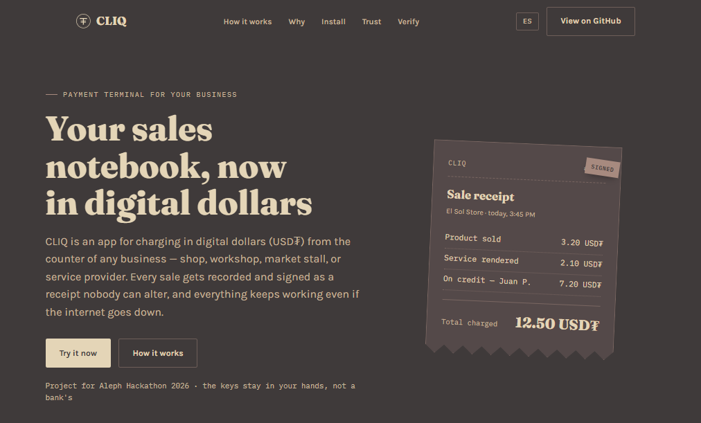

<p align="center">
  
</p>

# CLIQ

Terminal de pagos USD₮ autocustodial para comercios en general, distribuida como CLI P2P mediante Pear, con libro mayor firmado y sincronizado por Hyperswarm, y consultas locales con QVAC.

Proyecto para [Aleph Hackathon 2026](https://hacki.crecimiento.build/h/aleph-hackathon-2026).

## Que incluye

- **Pagos en USD₮** con wallet autocustodial (WDK): direccion, balance, cotizacion de comision y transferencia.
- **Facturas y cobros**: crear una factura, cotizar el pago, confirmarlo (`--yes`), con estados explicitos (nunca se simula un pago que no ocurrio).
- **Libro mayor firmado**: cada pago genera un recibo firmado (Ed25519) y encadenado a los recibos anteriores del mismo comercio; `receipt verify` detecta cualquier alteracion.
- **Sincronizacion P2P** entre terminales via Hyperswarm, con deteccion de conflictos en vez de sobrescritura silenciosa.
- **Asistente local (QVAC)**: preguntas en lenguaje natural sobre las ventas propias, sin mandar datos a ningun servidor.
- **Distribucion P2P via Pear**, con actualizaciones automaticas (OTA) sin tienda de aplicaciones ni servidor central.

## Documentacion

- [`architecture.md`](architecture.md) — arquitectura tecnica completa (en ingles).
- [`brandkit.md`](brandkit.md) — paleta, tipografia, logo y guia de voz para armar presentaciones (en ingles).
- [`deck.md`](deck.md) — contenido del pitch deck, diapositiva por diapositiva (en ingles).
- [`TESTING.md`](TESTING.md) — checklist de todo lo validado contra infraestructura real (WDK, sync P2P, QVAC, Pear, Pear Track, WDK Track), comando por comando.
- [`pear-cli/README.md`](pear-cli/README.md) — la entrega del Pear Track: CLI standalone instalable con `pear install` + OTA real.
- Más abajo, sección ["WDK Track — agente con guardrails"](#wdk-track-tether--agente-con-guardrails-sobre-tetherowdk-cli--mcp): la entrega del WDK Track.

## Landing page

<p align="center">
  <a href="public/index.html">
    
  </a>
</p>

La pagina de presentacion del proyecto vive en [`public/index.html`](public/index.html) — es parte del repositorio, no un enlace externo aparte. Para verla:

```bash
open public/index.html                 # macOS
xdg-open public/index.html              # Linux
# o levantar un servidor estatico simple:
npx serve public
```

Es un archivo HTML autocontenido (sin build, sin dependencias del proyecto) pensado para explicar CLIQ a un comerciante, no a un desarrollador. La marca (`public/assets/logo-mark.svg`, `logo-mark-dark.svg`, `logo-lockup.svg`) representa un sello de recibo firmado con el simbolo de USD₮, usando la misma paleta de colores que el resto de la pagina.

## Problema

Un comercio pequeno necesita cobrar en USD₮, llevar sus cuentas y verificar sus recibos sin depender de un servidor central ni de conectividad permanente.

## Tracks

1. **WDK** (principal) - wallet, balance, invoices y transferencias.
2. **Pears** (secundario) - distribucion e instalacion OTA de la CLI.
3. **QVAC** - consultas en lenguaje natural sobre el libro mayor (`ask`), y reconciliacion de comprobantes via OCR + LLM local (`reconcile`, QVAC Track 1).

## Estado actual

- [x] Fase 1 - Esqueleto de CLI (`merchant help`, `merchant version`, `merchant init`)
- [x] Fase 2 - Wallet y balance (WDK): `wallet address`, `wallet balance`, `wallet generate-seed`
- [x] Fase 3 - Invoice y transferencia: `invoice create`, `invoice show`, `pay`
- [x] Fase 4 - Libro mayor firmado: `ledger`, `receipt show`, `receipt verify`
- [x] Fase 5 - Sincronizacion P2P (Hyperswarm): `sync`, `peers`
- [x] Fase 6 - Consultas con QVAC: `ask`
- [x] Fase 7 - Release y OTA con Pear (`stage`/`seed`/`dump` probados contra la red real, ver seccion abajo)
- [x] Pear Track - CLI standalone instalable con `pear install` + actualizacion OTA real, ver [`pear-cli/`](pear-cli/)
- [x] WDK Track (1/2) - agente con guardrails sobre `@tetherto/wdk-cli` + MCP, ver seccion abajo
- [x] WDK Track (2/2, gasless) - pago real sin ETH, fee en USD₮ (ERC-4337 + paymaster Pimlico), ver seccion abajo
- [x] QVAC Track (1/2, reconciliacion) - OCR + LLM local para conciliar comprobantes contra facturas, ver seccion abajo

## Requisitos

- [Node.js](https://nodejs.org) 18 o superior (usado para `npm install`).
- [`bare`](https://www.npmjs.com/package/bare) instalado globalmente para correr el CLI en desarrollo: `npm install -g bare`.
- [`pear`](https://www.npmjs.com/package/pear) instalado globalmente, solo si vas a probar la distribucion P2P (Fase 7): `npm install -g pear`. Requiere red abierta hacia la DHT — ver la seccion "Release y OTA con Pear" mas abajo.

## Instalacion

```bash
npm install
```

### Ejecutar con Bare (runtime local, sin red P2P)

```bash
bare index.js help
bare index.js version
bare index.js init --network testnet
```

### Ejecutar con Pear

```bash
pear stage <link>          # <link> lo genera "pear touch"
pear dump <link> <carpeta> # baja el proyecto a una carpeta, como lo haria otro peer
```

> Nota: la version del CLI de Pear usada acá (3.2.0) cambió respecto a versiones anteriores: `pear run` fue **eliminado** (ya no existe ese comando) y `pear stage <canal>` ya no acepta un nombre de canal como "dev" — ahora pide un link `pear://...` generado con `pear touch`. Ver la seccion "Release y OTA con Pear" mas abajo para el detalle completo, ya probado contra la red real (no una guia teórica).

## Comandos disponibles

```bash
merchant init [--network testnet]        # Inicializa la identidad P2P y el almacen local
merchant wallet generate-seed             # Genera una seed phrase de prueba (solo dev/testnet)
merchant wallet address [--index 0]       # Muestra la direccion EVM de la cuenta (WDK)
merchant wallet balance [--index 0] [--token 0x...]  # Balance nativo y USD₮
merchant invoice create --amount 12.50 [--currency USDT] [--memo "..."] [--index 0]  # Crea una factura
merchant invoice show <id>                # Muestra el detalle de una factura
merchant pay <invoice-id> [--from-index 1] [--yes]  # Cotiza (y con --yes, envia) el pago
merchant ledger                           # Lista los eventos firmados del libro mayor
merchant receipt show <id>                # Muestra el detalle de un recibo firmado
merchant receipt verify <id>              # Verifica firma y encadenamiento de un recibo
merchant sync --room <sala> [--timeout 20000]   # Sincroniza el libro mayor con otras terminales
merchant peers --room <sala> [--timeout 8000]   # Lista los peers detectados en una sala
merchant ask "<pregunta>"                 # Consulta el libro mayor en lenguaje natural (QVAC, local)
merchant version                          # Muestra la version instalada
merchant help                             # Muestra la ayuda
```

### Flujo de cobro (Fase 3)

```bash
bare index.js invoice create --amount 12.50 --memo "Compra #1042"
# -> Invoice ID: inv_xxxxxxxxxxxx

bare index.js invoice show inv_xxxxxxxxxxxx

bare index.js pay inv_xxxxxxxxxxxx
# Sin --yes: solo cotiza (monto + comision de red), no envia nada.

bare index.js pay inv_xxxxxxxxxxxx --yes
# Con --yes: ejecuta la transferencia ERC-20 real desde la cuenta --from-index
# (por defecto 1, para simular un "cliente" distinto del comercio con la misma seed).
```

Las facturas se guardan en `.cliq/invoices.json`. Estados posibles: `pending` -> `submitted` (transaccion transmitida, con `txHash`) o `failed` (con el error). `pay` nunca marca una factura como pagada sin que WDK haya devuelto un hash de transaccion real; si la red falla, la factura queda `pending`/`failed`, nunca `submitted`.

### Libro mayor firmado (Fase 4)

Cada `pay --yes` exitoso agrega un evento `invoice_paid` firmado a `.cliq/ledger/events.json`, encadenado con el evento anterior (como un mini blockchain local, append-only):

```bash
bare index.js ledger                        # Lista todos los eventos
bare index.js receipt show <receipt-id>      # Detalle de un recibo
bare index.js receipt verify <receipt-id>    # Verifica firma + encadenamiento
```

`receipt verify` comprueba:
1. **Firma** - el evento fue firmado con la clave privada de la identidad P2P del comercio (generada en `merchant init`, Ed25519 via `hypercore-crypto`) y cubre todos los campos (monto, destinatario, txHash, etc.), asi que alterar cualquiera de ellos invalida la firma.
2. **Encadenamiento** - el campo `previousEventHash` del evento coincide con el hash del evento inmediatamente anterior en el almacen local; si alguien edita o reordena un evento previo, el siguiente deja de verificar.

Probe ambos casos manualmente: cadena valida de dos eventos, y luego edite a mano el monto del primer evento en `events.json` para confirmar que `receipt verify` detecta la firma invalida en ese evento **y** la ruptura del encadenamiento en el siguiente (exit code 1 en ambos casos). No use conexion RPC real para esto - la firma y el hash chain son 100% locales, asi que se pudo validar completo en este entorno pese a la restriccion de red.

**Nota:** el encadenamiento (`previousEventId`/`previousEventHash`) es *por comercio*, no global al archivo: cada identidad P2P encadena solo sus propios eventos anteriores. Este es un ajuste sobre la primera version de la Fase 4, necesario para que la Fase 5 (varios comercios escribiendo al mismo almacen local via sync) no rompa la cadena de nadie.

### Sincronizacion P2P (Fase 5)

```bash
# Terminal A
bare index.js sync --room tienda-demo

# Terminal B (otra carpeta/otro .cliq, red de prueba compartida)
bare index.js sync --room tienda-demo

# Solo descubrir quien esta en la sala, sin intercambiar eventos:
bare index.js peers --room tienda-demo
```

`sync` se une a una sala P2P via Hyperswarm (topic = hash de `cliq:ledger:<room>`, DHT publica). Al conectar con cada peer, ambos lados se mandan su libro mayor local completo como un mensaje JSON; cada evento recibido se verifica (firma + encadenamiento por comercio) antes de aceptarse, se ignoran los duplicados por `id`, y al final se listan los conflictos: mismo `invoiceId` con `txHash` distintos entre eventos de distintos comercios (posible doble registro), marcados para revision manual en vez de resolverse automaticamente.

**Simplificacion de diseño respecto al plan original:** en vez de que cada terminal tenga su propio Hypercore (feed append-only) y replicarlos entre si por clave publica (el patron estandar de Hypercore/corestore para multi-writer), implemente un intercambio directo de los eventos ya firmados (JSON delimitado por saltos de linea) sobre la conexion cifrada de Hyperswarm. La propiedad de seguridad que importa (que nadie pueda falsificar o alterar un evento) ya la da la firma Ed25519 de la Fase 4, que es independiente del transporte — un protocolo mas simple no resigna nada de eso. El resultado es mas facil de auditar y cubre el objetivo central de la Fase 5 ("replicacion de eventos, no sincronizacion de wallets"), y ya se probo funcionando de punta a punta contra la DHT real (ver arriba). Migrar a Hypercore+corestore por feed sigue siendo un paso valido si en algun momento hace falta el patron estandar (por ejemplo, para reproducir el historial completo de un peer nuevo en vez de solo el estado actual).

**Robustez de red:** `swarm.join(...).flushed()` y `swarm.destroy()` pueden colgarse indefinidamente si no se puede alcanzar el bootstrap de la DHT (lo confirme en este sandbox: sin el fix, `merchant peers` nunca terminaba). Por eso ninguno de los dos se espera de forma bloqueante; el comando siempre termina dentro de la ventana `--timeout` mas un margen fijo de limpieza, haya o no red disponible.

**Probado contra la red real:** dos identidades de comercio independientes (dos carpetas `.cliq` separadas) corriendo `sync --room` al mismo tiempo se descubrieron de verdad por la DHT, intercambiaron sus libros mayores, y detectaron correctamente un conflicto provocado a proposito (misma `invoiceId`, dos `txHash` distintos) en vez de pisarlo. El descubrimiento tardo ~60s, no los 20s por defecto — este entorno reporta `firewalled: true` / `NAT type: consistent` en la DHT, algo a tener en cuenta tambien en produccion, no solo aca. Detalle completo en `TESTING.md`.

### Consultas con QVAC (Fase 6)

```bash
bare index.js ask "que facturas estan pendientes?"
bare index.js ask "cuanto vendi en total?"
```

`ask` arma un contexto de texto con las facturas y el libro mayor local (`src/ai/context.js`), y se lo pasa a un modelo de lenguaje local via `@qvac/sdk` (`loadModel` + `completion`, modelo por defecto `LLAMA_3_2_1B_INST_Q4_0`, configurable con `QVAC_MODEL` en `.env`). Todo corre en la maquina, sin mandar datos a un servidor externo. QVAC es estrictamente un bonus de consulta: **si falla o no esta disponible, el resto de CLIQ (pagos, ledger, sync) sigue funcionando igual** — `ask` nunca bloquea ni condiciona al resto de comandos.

**Probado de punta a punta contra la red real:**
- El armado del contexto (`src/ai/context.js`) es logica pura sin red: probado end-to-end con facturas reales.
- La carga del addon y el registro del plugin (`@qvac/sdk/plugins`, `@qvac/sdk/llamacpp-completion/plugin`) funcionan (el addon nativo `@qvac/llm-llamacpp`, ~520MB, viene incluido como dependencia transitiva de `@qvac/sdk`).
- La descarga del modelo (773MB, distribuida por el mismo registry P2P que usa Hyperswarm) **se completo** (~3 minutos con conectividad real) y `completion` devolvio una respuesta real basada en los datos locales.
- **Bug real encontrado y arreglado probando esto:** sin proteccion, `loadModel` se queda esperando la descarga para siempre si no hay red (se confirmo colgado hasta matarlo a mano). Se agrego un timeout configurable (`QVAC_LOAD_TIMEOUT_MS` en `.env`, default 120s) para que `ask` siempre termine con un mensaje claro en vez de colgarse — y en la practica hizo falta subirlo por encima del default, porque la descarga real tardo mas de 120s.
- Si `ask` falla por cualquier motivo (sin red, sin el addon instalado, timeout), imprime el error y ademas el contexto crudo que le hubiera mandado al modelo, para que el comando siga siendo util aunque la IA no responda.
- **Nota sobre calidad de respuesta:** con el modelo default (1B parametros, cuantizado Q4), la respuesta a preguntas concretas sobre el libro mayor puede ser poco precisa (ej. no sumar montos correctamente). Esto es una limitacion del tamaño del modelo, no un bug de la integracion — considerar un modelo mas grande si la precision importa mas que la velocidad/tamaño.

**Aviso de espacio en disco:** `@qvac/sdk` (el paquete "completo", pensado para Node/Expo) trae **todos** sus addons nativos como dependencias — llm, whisper, ocr, tts, difusion de imagenes, etc. — aunque solo se use uno. En este entorno, `npm install` con `@qvac/sdk` hizo crecer `node_modules` a **~6GB**. Para el CLI final via Pear conviene migrar a [`@qvac/bare-sdk`](https://www.npmjs.com/package/@qvac/bare-sdk) instalando *solo* `@qvac/llm-llamacpp` (el addon de completion, ~520MB) y armando un worker entry propio (`qvac/worker.pear.entry.mjs`, ver docs de `@qvac/bare-sdk`) — deje `@qvac/sdk` por simplicidad y porque tambien corre en Node (mas facil de probar en tu maquina), pero no lo instales si el espacio en disco es limitado.

## QVAC Track (Tether) — Track 1: reconciliacion de comprobantes (OCR + LLM local)

El caso de uso insignia que pide el brief de QVAC (agentes locales para trabajo de back-office: reconciliacion de facturas) mapea directo al dominio que CLIQ ya tiene — facturas reales — asi que se construyo sobre eso, no como una demo generica aparte.

```bash
bare index.js reconcile <invoice-id> <ruta-a-la-imagen-del-comprobante> [--json]
```

Que hace: toma una foto/escaneo de un comprobante de pago, le corre OCR local (`@qvac/sdk` + addon `@qvac/ocr-ggml`, modelo `OCR_LATIN` de EasyOCR — detector CRAFT derivado automaticamente por el registry), y compara el texto extraido contra la factura ya registrada en CLIQ, marcando `COINCIDE` / `NO_COINCIDE` / `INCIERTO` con una explicacion en espanol verificable en cinco segundos. No cambia el estado de la factura: es una lectura asistida para que un humano decida, no un pago automatico.

**Decision de diseño clave, encontrada probando esto de verdad:** en la primera corrida real, el modelo de texto (`LLAMA_3_2_1B_INST_Q4_0`, el mismo que usa `ask`) extrajo *correctamente* el monto del comprobante (`12`) pero dijo `VEREDICTO: COINCIDE` contra una factura de `5` — un modelo de 1B es bueno extrayendo texto pero malo comparando numeros. La solucion no fue "mejorar el prompt": el veredicto final **nunca sale del modelo**. `src/ai/qvac.js` (`computeVerdict`) toma el monto que el modelo extrajo y lo compara con el de la factura *en codigo*, con el mismo criterio de "el guardrail vive en codigo, no en el prompt" que ya se uso en `agent.js` (WDK Track 1). El veredicto que el modelo mismo dio se guarda aparte (`modelVerdict`) solo para poder detectar y mostrar el desacuerdo (`modelDisagreed: true`), nunca para decidir.

**Probado con comprobantes sinteticos generados para esta prueba** (no hay camara en este entorno de desarrollo; se documenta como lo que es, no se presenta como fotos reales):
- Comprobante limpio con el monto correcto -> `COINCIDE`, el modelo extrae el monto bien y coincide con su propio veredicto.
- Mismo comprobante rotado 3° + ruido + blur simulando una foto con mala luz -> OCR sigue leyendo el texto correcto (1 bloque en vez de 4, pero completo) -> `COINCIDE`.
- Comprobante con un monto distinto al de la factura (`12` contra una factura de `5`) -> este es el caso que expuso el bug de arriba: el modelo dijo `COINCIDE`, el veredicto calculado en codigo dice `NO_COINCIDE` (correcto) y marca `modelDisagreed: true`.
- Imagen en blanco (sin texto) -> falla explicito ("no se detecto texto legible"), no inventa un monto.
- Factura inexistente / archivo de imagen inexistente -> falla explicito antes de tocar el modelo.

**Modelo y hardware:** `OCR_LATIN` (EasyOCR, detector CRAFT auto-derivado, ~15MB + ~83MB) y `LLAMA_3_2_1B_INST_Q4_0` (1B parametros, cuantizado Q4), ambos via `@qvac/sdk` sobre Bare, corridos en un contenedor de 4 vCPU (AMD EPYC 9V74) / 15GB RAM, sin GPU. Una corrida completa (OCR + reconciliacion, cargando y descargando ambos modelos de memoria en cada llamada, sin daemon) tarda **~24s** en este hardware.

**Limitacion honesta:** las explicaciones en espanol que da el modelo a veces son gramaticalmente imprecisas o mencionan detalles menores incorrectos (ej. "el monto no es claro" en un caso donde si lo detecto bien) aunque el veredicto final (calculado en codigo, no por el modelo) sea correcto — es una limitacion conocida de un modelo de 1B generando texto libre, no del pipeline de reconciliacion en si. El veredicto es lo que importa para la decision; la explicacion es solo un resumen para que el humano la lea mas rapido, siempre acompañada del texto OCR crudo para que pueda verificar a mano.

**Permalinks a donde corre la inferencia QVAC** (reemplazar `main` por el commit exacto al pushear):
- [`src/ai/qvac.js`](https://github.com/Gabrululu/Cliq/blob/6ad6b1e81194d1fdff48ebaa10e8e88f862372d1/src/ai/qvac.js) — `ocrImage` (OCR) y `reconcileReceipt` + `computeVerdict` (LLM + guardrail de comparacion en codigo).
- [`src/commands/reconcile.js`](https://github.com/Gabrululu/Cliq/blob/6ad6b1e81194d1fdff48ebaa10e8e88f862372d1/src/commands/reconcile.js) — comando `merchant reconcile`.

### Configurar la wallet (WDK)

1. Copia `.env.example` a `.env`.
2. Genera una seed de prueba: `bare index.js wallet generate-seed` (o `pear run . -- wallet generate-seed`) y pegala en `MERCHANT_SEED_PHRASE`.
3. Define `WDK_RPC_URL` con el endpoint RPC de tu red EVM de prueba (ej. Sepolia).
4. Opcional: `WDK_USDT_CONTRACT` con la direccion del contrato USD₮ de esa red de prueba y `WDK_USDT_DECIMALS` (por defecto 6) si difiere.
5. `bare index.js wallet address` y `bare index.js wallet balance`.

La wallet usa `@tetherto/wdk` + `@tetherto/wdk-wallet-evm` (modulo EVM oficial de WDK). La derivacion de direcciones (`wallet address`) es local y no requiere red; `wallet balance` si necesita que `WDK_RPC_URL` sea alcanzable.

## Modelo de datos

`merchant init` genera una identidad P2P (par de claves Ed25519) y crea un almacen local en `./.cliq/`. Esa identidad firma los eventos del libro mayor (`.cliq/ledger/events.json`), que `merchant sync` replica entre terminales via Hyperswarm. Es independiente de la wallet de pagos (WDK), que deriva sus propias cuentas desde `MERCHANT_SEED_PHRASE`.

Cada evento del libro mayor sigue el modelo:

```json
{
  "id": "receipt_...",
  "type": "invoice_paid",
  "merchant": "<clave publica P2P del comercio>",
  "invoiceId": "inv_...",
  "amount": "12500000",
  "currency": "USDT",
  "decimals": 6,
  "chain": "testnet",
  "payer": "0x...",
  "recipient": "0x...",
  "txHash": "0x...",
  "createdAt": "2026-08-22T21:16:18.504Z",
  "previousEventId": "<id del evento anterior de este mismo comercio, o null si es el primero>",
  "previousEventHash": "<hash hex del evento anterior o null si es el primero>",
  "signature": "<firma hex sobre todo lo anterior>"
}
```

La serializacion es JSON canonico (claves ordenadas alfabeticamente, `src/ledger/canonical.js`) para que la firma sea determinista sin importar el orden de insercion de los campos. `previousEventId` permite ubicar el evento referenciado sin depender del orden de almacenamiento (importante una vez que el almacen mezcla eventos de varios comercios via sync); `previousEventHash` es la propiedad criptografica que efectivamente protege el encadenamiento.

## Release y OTA con Pear (Fase 7)

**Probado contra la red real** (no una guia teorica): `pear stage`, `pear seed` y `pear dump` corrieron de verdad contra la DHT. La CLI de Pear que esta disponible hoy (v3.2.0) cambio bastante respecto a lo que documentaba una version anterior de este archivo — el flujo real es distinto en varios puntos, detallados abajo.

### Config real en `package.json`

```json
"pear": {
  "name": "cliq",
  "stage": {
    "ignore": [".env", ".cliq", ".git"]
  }
}
```

`pear.stage.ignore` es importante por seguridad: `pear stage` no respeta `.gitignore`, tiene su propia lista de exclusion. Sin esto, `.env` (con la seed phrase) y `.cliq/` (con la clave secreta P2P) se publicarian tal cual al link de Pear, que es publico/distribuido por DHT. Se confirmo con `pear info --manifest` que ninguno de los dos aparece en lo publicado.

### Pasos reales (v3.2.0 del CLI de Pear)

```bash
# 1. Instalar el CLI de Pear (bootstrapea la primera vez que se corre)
pnpm add -g pear

# 2. Generar un link nuevo (reemplaza al viejo esquema de "canales" tipo `pear stage dev`)
pear touch
# -> pear://<key>

# 3. Stage: sincroniza el directorio actual a ese link
pear stage pear://<key>

# 4. Seed: hace que el link este disponible para otros peers via DHT
#    (tiene que seguir corriendo mientras alguien quiera instalar/actualizar)
pear seed pear://<key> --no-tty

# 5. Bajar el proyecto en otra carpeta/maquina, como lo haria otro peer
#    ("pear run" fue eliminado en esta version del CLI)
pear dump pear://<key> <carpeta-destino>
cd <carpeta-destino> && bare index.js help

# 6. Iterar: cualquier cambio + volver a "pear stage pear://<key>" (mismo link)
#    hace que la version en el drive avance; los peers que hagan "pear dump"
#    de nuevo (o instalen via pear-cli/, ver mas abajo) reciben el cambio.
```

**Diferencias reales encontradas respecto a documentacion mas vieja:**
- `pear stage <canal>` (nombre de canal tipo "dev"/"production") **ya no existe** — ahora siempre es `pear stage <link>`, con el link generado por `pear touch`.
- `pear run` **fue eliminado por completo** del CLI. El equivalente que si funciona es `pear dump <link> <carpeta>` (baja los archivos) + correr `bare index.js` ahi.
- `pear release` tambien fue eliminado. El modelo de "produccion" ahora es `pear provision` + `pear multisig` (firma por quorum) — investigado pero no implementado, ver "Limitaciones conocidas" abajo.

### CLI standalone instalable con `pear install` (Pear Track)

Ademas de lo anterior (que corre CLIQ via `bare index.js`, requiere tener `bare` instalado), hay una entrega separada en [`pear-cli/`](pear-cli/): la misma CLI compilada como **binario standalone**, instalable con un solo comando y sin necesitar Node/Bare/Pear en la maquina que instala:

```bash
pear install pear://<pear-cli-key>
cliq-cli --version
```

Con actualizaciones OTA reales probadas de punta a punta (una copia instalada se actualizo sola en ~2 segundos tras stagear una version nueva). Detalle completo, incluidos dos bugs reales encontrados y arreglados en el proceso, en [`pear-cli/README.md`](pear-cli/README.md) y en `TESTING.md` seccion 8.

## WDK Track (Tether) — Track 1: agente con guardrails sobre `@tetherto/wdk-cli` + MCP

Track separado del hackathon, mismo sponsor que Pears (regla del brief: "Pick one prize track and go deep" dentro de WDK — se implementaron los dos premios igual, ver tambien la seccion "Track 2" mas abajo).

**Paquetes WDK usados** (version instalada, ver `package.json`):
- `@tetherto/wdk-cli` `1.0.0-beta.3` — el CLI/wallet local + servidor MCP nativo, pieza central de esta entrega.
- `@modelcontextprotocol/sdk` `1.30.0` — para el servidor MCP propio con los guardrails.
- (ya presentes desde antes) `@tetherto/wdk` `1.0.0-beta.16` + `@tetherto/wdk-wallet-evm` `1.0.0-beta.17` — la capa de pagos original de CLIQ (`pay.js`), sin tocar.

**Que se construyo**: un comando nuevo, `merchant agent settle <invoice-id> [--yes]`, que paga facturas de CLIQ usando `wdk-cli` (no el SDK crudo que ya usaba `pay.js`), con guardrails **en codigo**:
1. Tope de gasto (`AGENT_SPEND_CAP_USDT` en `.env`) — rechaza antes de tocar la red si la factura lo supera.
2. El destinatario es siempre el de la factura — nunca un parametro libre que el agente (o quien le hable) pueda elegir.
3. Confirmacion explicita — sin `--yes` solo cotiza via `wdk send --dry-run`.

Expuesto a un agente de IA con un servidor MCP propio, [`mcp/server.js`](mcp/server.js), con dos tools: `quote_invoice_payment` y `confirm_invoice_payment` — ninguna de las dos acepta un monto o direccion libre, solo un `invoiceId`.

**Permalinks a donde se usa WDK** (reemplazar `main` por el commit exacto al pushear):
- [`src/commands/agent.js`](https://github.com/Gabrululu/Cliq/blob/6ad6b1e81194d1fdff48ebaa10e8e88f862372d1/src/commands/agent.js) — llama a `wdk send`/`wdk get` vía `bare-subprocess`, con los guardrails (Track 1).
- [`mcp/server.js`](https://github.com/Gabrululu/Cliq/blob/6ad6b1e81194d1fdff48ebaa10e8e88f862372d1/mcp/server.js) — servidor MCP que expone los dos tools (Track 1).
- [`src/commands/gasless.js`](https://github.com/Gabrululu/Cliq/blob/6ad6b1e81194d1fdff48ebaa10e8e88f862372d1/src/commands/gasless.js) — pago gasless via ERC-4337 + paymaster (Track 2).

### Setup desde un clon limpio

```bash
npm install    # o pnpm install — instala @tetherto/wdk-cli entre otras deps

# 1. Importar la MISMA seed que ya usa CLIQ (.env) al wallet de wdk-cli
grep MERCHANT_SEED_PHRASE .env | cut -d= -f2- | \
  WDK_PASSPHRASE="elegi-una-passphrase" ./node_modules/.bin/wdk wallet import --name cliq --seed-stdin

# 2. Desbloquear (queda un daemon en background; ttl 0 = no expira)
WDK_PASSPHRASE="elegi-una-passphrase" ./node_modules/.bin/wdk wallet unlock --name cliq --ttl 0

# 3. Registrar el token USD₮ de prueba (el "usdt" built-in de wdk-cli en Sepolia
#    apunta al contrato oficial, que no podemos mintear — ver TESTING.md #9)
./node_modules/.bin/wdk token add '{"network":"sepolia","token":"tpusdt","symbol":"tpUSDT","decimals":6,"isNative":false,"address":"0xc4dcc311c028e341fd8602d8eb89c5de94625927"}'

# 4. Probar
bare index.js agent settle <invoice-id>          # cotiza
bare index.js agent settle <invoice-id> --yes    # paga de verdad

# 5. Habilitar el MCP server para un agente (Claude Code ya lo lee via .mcp.json en este repo)
#    Para Claude Desktop / OpenClaw, usar el setup nativo de wdk-cli para sus propios tools:
./node_modules/.bin/wdk mcp setup --ai-tool claude-code
```

**Red y tokens**: Sepolia (`chainId 11155111`). Token de prueba: `ERC20Mock` en `0xc4dcc311c028e341fd8602d8eb89c5de94625927` (mismo contrato usado en la seccion 2 de `TESTING.md`, con `mint(address,uint256)` publico para autoabastecerse).

**Validado de punta a punta** (ver `TESTING.md` seccion 9 para el detalle completo, con salidas reales): mismo wallet confirmado vía `wdk get address`, balance real leido, cotizacion y pago real (`txHash` real, recibo firmado igual que `pay`), guardrail de tope rechazando una factura de 50 USDT con el tope en 10, y las dos tools probadas a traves del protocolo MCP real (no solo por CLI).

## WDK Track — Track 2: pago gasless (fee en USD₮, sin ETH)

**Modulo usado**: `@tetherto/wdk-wallet-evm-erc-4337` (viene incluido como dependencia de `@tetherto/wdk-cli`) — cuentas inteligentes ERC-4337 con paymaster, para que quien paga no necesite tener ETH: el fee de red se cobra en USD₮.

**Que se construyo**: `merchant gasless pay <invoice-id> [--yes]` ([`src/commands/gasless.js`](https://github.com/Gabrululu/Cliq/blob/6ad6b1e81194d1fdff48ebaa10e8e88f862372d1/src/commands/gasless.js)) — mismo patron que `agent settle` (cotiza sin `--yes`, paga de verdad con `--yes`, genera el mismo recibo firmado), pero contra una **cuenta inteligente** en vez de la wallet EVM comun. La cuenta inteligente tiene una direccion distinta a la wallet normal (confirmado: `0x8469a1A3...` vs `0x86aCC9bc...` del mismo seed) y nunca necesito ETH para pagar — el paymaster de Pimlico cobra el fee directo en USD₮.

### Setup (adicional al de Track 1)

```bash
# 1. Reclamar USD₮ de prueba para el paymaster (fixture de Pimlico, precio de oraculo fijo en $1):
#    https://dashboard.pimlico.io -> Test Faucet -> USD₮ (Test) -> Sepolia -> tu direccion
#    (la direccion de "wdk get address --network sepolia --index 1")

# 2. Conseguir tu API key: dashboard.pimlico.io -> API Keys -> Create API key
#    Guardarla en .env como PIMLICO_API_KEY=...

# 3. Averiguar la direccion real del paymaster para USD₮ en Sepolia (NO es un valor fijo,
#    Pimlico la devuelve por API — no la copies de otro lado):
curl -s -X POST -H "Content-Type: application/json" \
  -d '{"jsonrpc":"2.0","id":1,"method":"pimlico_getTokenQuotes","params":[{"tokens":["0xd077A400968890Eacc75cdc901F0356c943e4fDb"]},"0x0000000071727De22E5E9d8BAf0edAc6f37da032","0xaa36a7"]}' \
  "https://api.pimlico.io/v2/11155111/rpc?apikey=$PIMLICO_API_KEY"
# -> result.quotes[0].paymaster

# 4. Crear la network gasless custom en wdk-cli (usar la direccion del paso 3):
./node_modules/.bin/wdk network create '{
  "network": "smart-account-sepolia-pimlico",
  "displayName": "Smart Account Sepolia (Pimlico)",
  "module": "@tetherto/wdk-wallet-evm-erc-4337",
  "nativeSymbol": "ETH",
  "decimals": 18,
  "testnet": true,
  "config": {
    "chainId": 11155111,
    "provider": "https://ethereum-sepolia-rpc.publicnode.com",
    "bundlerUrl": "https://api.pimlico.io/v2/11155111/rpc?apikey='"$PIMLICO_API_KEY"'",
    "paymasterUrl": "https://api.pimlico.io/v2/11155111/rpc?apikey='"$PIMLICO_API_KEY"'",
    "paymasterAddress": "<resultado del paso 3>",
    "entryPointAddress": "0x0000000071727De22E5E9d8BAf0edAc6f37da032",
    "safeModulesVersion": "0.3.0",
    "paymasterToken": { "address": "0xd077A400968890Eacc75cdc901F0356c943e4fDb" },
    "transferMaxFee": 1000000000
  }
}'
./node_modules/.bin/wdk token add '{"network":"smart-account-sepolia-pimlico","token":"eth","symbol":"ETH","decimals":18,"isNative":true}'
./node_modules/.bin/wdk token add '{"network":"smart-account-sepolia-pimlico","token":"usdt","symbol":"USD₮","decimals":6,"isNative":false,"address":"0xd077A400968890Eacc75cdc901F0356c943e4fDb"}'

# 5. Fondear la cuenta inteligente (la direccion cambia respecto a la wallet normal):
#    wdk get address --network smart-account-sepolia-pimlico --index 1
#    Transferirle USD₮ desde la wallet normal una vez (ese paso si necesita ETH):
./node_modules/.bin/wdk send --network sepolia --to <direccion-cuenta-inteligente> --amount 100 --token usdt-official --index 1

# 6. IMPORTANTE: reiniciar el daemon para que tome la config nueva
#    (wdk-cli cachea la config de networks al arrancar el daemon en background)
./node_modules/.bin/wdk wallet lock --all
WDK_PASSPHRASE="..." ./node_modules/.bin/wdk wallet unlock --name cliq --ttl 0

# 7. Probar
bare index.js gasless pay <invoice-id>          # cotiza, sin ETH
bare index.js gasless pay <invoice-id> --yes    # paga de verdad, fee en USD₮
```

**Validado de punta a punta con dinero real en Sepolia** (detalle completo en `TESTING.md` seccion 10): balance de ETH de la cuenta inteligente confirmado en 0 en todo momento, envio real con `txHash` real y fee cobrado en USD₮, recibo firmado y encadenado igual que el resto de los metodos de pago.

## Limitaciones conocidas

Esta lista refleja lo que **falta de verdad**, no lo que "no se pudo probar" — todo lo que sigue si se probo contra red real (ver `TESTING.md` para el detalle completo, comando por comando):

- No hay direccion de contrato USD₮ de testnet precargada por defecto: hay que configurar `WDK_USDT_CONTRACT` con la del token de prueba que uses (evita asumir una direccion incorrecta en la demo). En Sepolia se uso un `ERC20Mock` con `mint(address,uint256)` publico para autoabastecerse de tokens de prueba — ver `TESTING.md` seccion 2.
- `pay` marca una factura como `submitted` en cuanto WDK transmite la transaccion (`eth_sendRawTransaction`), no espera confirmaciones on-chain; el ledger tampoco tiene un estado `confirmed` todavia (solo registra que se transmitio, con su `txHash`).
- El modelo QVAC por defecto (1B parametros, cuantizado) puede dar respuestas poco precisas sobre datos numericos del ledger (ver nota en la seccion QVAC arriba) — no es un bug, es una limitacion de tamaño del modelo.
- El flujo de "produccion" con multisig de Pear (`pear provision` + `pear multisig`) se investigo pero no se implemento — se decidio que no vale la pena la complejidad de gobernanza de releases para el tamaño actual del proyecto. Detalle completo en `TESTING.md` seccion 7.
- La CLI standalone de `pear-cli/` (Pear Track) solo se buildeo para **linux-x64** — hace falta un host macOS/Windows (o CI) para generar esos binarios.
- El `pear seed` de cualquiera de los links (landing/app o `pear-cli/`) tiene que seguir corriendo en una maquina que se mantenga prendida durante el periodo de judging — un sandbox de desarrollo efimero no alcanza para eso.
- La network gasless custom (`smart-account-sepolia-pimlico`) vive en la config local de `wdk-cli` (`~/.config/wdk-cli/config.json`), no en este repo — hay que recrearla en cada maquina nueva con los pasos de la seccion "WDK Track — Track 2" (incluida la API key propia de Pimlico, que no se comparte).
- Tras cualquier `wdk network create`/`wdk token add`, hay que reiniciar el daemon de `wdk-cli` (`wallet lock --all` + `wallet unlock`) para que tome la config nueva — no la relee solo. Bug real encontrado al implementar Track 2, documentado en `TESTING.md` seccion 10.
- `merchant agent settle` (WDK Track 1) requiere que el wallet de `wdk-cli` este importado y desbloqueado a mano una vez (`wdk wallet import` + `wdk wallet unlock --ttl 0`, ver seccion de arriba) antes de usarse — no lo hace el comando en si.
- `merchant reconcile` (QVAC Track 1) se probo con comprobantes sinteticos generados para la prueba, no con fotos reales de comprobantes en distintas condiciones de camara — el pipeline de OCR es real y corre local, pero la variedad de inputs "sucios" es limitada por no tener camara en este entorno de desarrollo.
- El addon `@qvac/ocr-ggml` (~500MB con sus binarios nativos) se suma al ya pesado `@qvac/sdk` — misma nota de espacio en disco que la seccion de `ask` de arriba.

## Seguridad

- `.cliq/` (identidad P2P) y `.env` (seed phrase de la wallet) contienen material sensible y estan excluidos de git via `.gitignore`. Nunca los commitees.
- `wallet generate-seed` es solo para desarrollo/testnet: nunca uses esa seed en mainnet ni la muestres en una demo grabada.
- No se muestran seed phrases reales en la documentacion ni en las demos.

## Estructura del proyecto

```
index.js              Punto de entrada (Bare o Pear)
src/
  cli.js               Enrutador de comandos
  commands/            Un archivo por comando del CLI (init, wallet, invoice, pay, ledger, receipt, sync, peers, ask...)
  payments/wdk.js       Integracion con WDK (wallet, balance, transferencias)
  invoices/store.js      Almacen local de facturas
  ledger/                Eventos firmados (creacion, verificacion, almacen)
  p2p/                    Sincronizacion via Hyperswarm (protocolo, fusion, swarm)
  ai/                     Contexto + integracion con QVAC para "merchant ask" y "merchant reconcile" (OCR + LLM)
  util/                   Helpers compartidos (flags, .env, formato de montos, paths)
  commands/agent.js       WDK Track 1: "agent settle", guardrails sobre @tetherto/wdk-cli
  commands/gasless.js     WDK Track 2: "gasless pay", fee en USD₮ via ERC-4337 + paymaster
  commands/reconcile.js   QVAC Track 1: "reconcile", conciliacion de comprobantes via OCR + LLM local
mcp/
  server.js               WDK Track: servidor MCP (Node.js) con los tools quote/confirm_invoice_payment
public/
  index.html             Landing page (autocontenida)
  assets/                 Logo y miniatura de la landing
pear-cli/                Pear Track: CLI standalone instalable con "pear install" + OTA (ver su propio README)
```

El detalle completo de cada modulo, el modelo de datos y las decisiones de diseño estan en [`architecture.md`](architecture.md).

## Licencia

MIT — ver el campo `license` en `package.json`.
